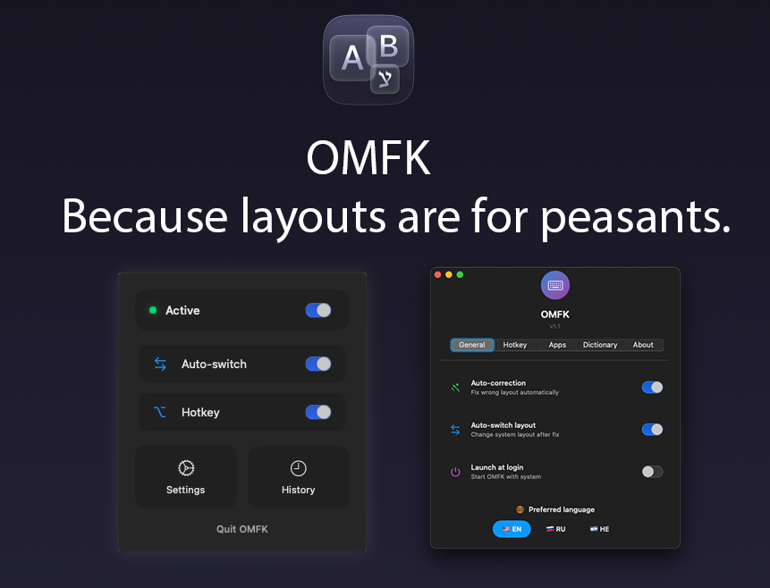
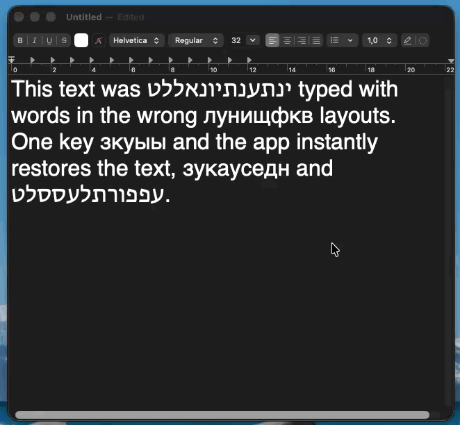

<div align="center">

# O.M.F.K

### AI-powered keyboard layout corrector for macOS



---



**[Website](https://hireex.ai/omfk)**

[](https://www.apple.com/macos/)
[](https://github.com/chernistry/omfk/releases/latest)
[]()

🇺🇸 English · 🇷🇺 Russian · 🇮🇱 **Hebrew**

</div>

---

## The Problem

You're typing, deep in thought... then you look up:

```
Ghbdtn, rfr ltkf?   →   Привет, как дела?
руддщ цщкдв          →   hello world
akuo                 →   שלום
```

Wrong keyboard layout. Again.

**OMFK fixes this automatically, as you type.**

---

## ✨ Key Features

<table>
<tr>
<td width="50%">

**🚀 Type without thinking**

Just type. OMFK detects wrong layouts on word boundaries and fixes them instantly. No hotkeys needed.

</td>
<td width="50%">

**🧠 Self-learning**

Learns from your corrections. Undo a word twice — OMFK remembers. Use Alt to pick an alternative — OMFK learns your preference.

</td>
</tr>
<tr>
<td>

**🔒 100% on-device**

Everything runs locally. No network calls. No logging. No telemetry. Your keystrokes never leave your Mac.

</td>
<td>

**⚡ Blazing fast**

Native CoreML model with CNN+Transformer ensemble trained on Wikipedia and OpenSubtitles dumps. Detection latency <50ms.

</td>
</tr>
<tr>
<td>

**🇮🇱 Hebrew support**

One of the few correctors that properly handles Hebrew — including QWERTY-based layouts with sofit letters (ץ ך ם ן ף).

</td>
<td>

**🔄 Hotkey cycling**

Press `Option` to cycle through alternatives: original → Russian → English → Hebrew → back.

</td>
</tr>
</table>

---

## Installation

### 1. Download

Get the latest `.pkg` installer from [Releases](https://github.com/chernistry/omfk/releases/latest).

### 2. Install

Double-click the PKG file and follow the installer prompts.

### 3. Grant Accessibility Access

On first launch, macOS will ask for Accessibility permission:

1. Open **System Settings → Privacy & Security → Accessibility**
2. Enable **OMFK**
3. OMFK will automatically start working once permission is granted

> **Note:** Accessibility access is required to monitor keyboard input. OMFK cannot function without it.

---

## Usage

| Action | How |
|--------|-----|
| Toggle auto-correction | Click menu bar icon |
| Cycle through alternatives | Press `Option` |
| Undo last correction | Press `Option` immediately after |
| Exclude an app | Settings → Per-App Rules |
| Manage learned words | Settings → Dictionary |

---

## Troubleshooting

### "App is damaged" error

If macOS says the app is damaged, run in Terminal:
```bash
xattr -cr /Applications/OMFK.app
```

### Corrections not working

1. Check Accessibility permission is enabled
2. Quit and reopen OMFK
3. Check if the app is in your exclusion list

### Wrong corrections

Press `Option` to cycle through alternatives, or disable auto-correction for that app.

---

## Known Limitations

- **Sublime Text:** Alt cycling may insert text instead of replacing (app-specific behavior)
- **Some terminal emulators:** May require clipboard fallback mode

---

## Requirements

- macOS Ventura (13.0) or later
- Apple Silicon or Intel Mac

---

## Feedback

Found a bug or have a feature idea? [Open an issue](https://github.com/chernistry/omfk/issues/new/choose).

---

<div align="center">

[Download](https://github.com/chernistry/omfk/releases/latest) · [Report Issue](https://github.com/chernistry/omfk/issues)

Made by [Alex Chernysh](https://hireex.ai)

</div>
